# Metrovelox

**London-transport analytics on Kubernetes — streaming + batch on one lakehouse, GitOps end-to-end.**

Running live at [metrovelox.com](https://metrovelox.com). Data Engineering
Zoomcamp 2026 capstone.

## Problem

London's transport network emits operational signals constantly — tube-line
status updates, bus-arrival predictions, cycle-hire dock occupancy. TfL
exposes them as live REST endpoints with no history, no cross-mode join,
and no low-latency fan-out. Metrovelox answers three concrete questions
off a single platform:

1. **Tube — where is service degrading, right now and over time?** Current
   severity per line, reason distribution, mean time between disruptions.
2. **Cycle hire — which docks are going empty or full, and when?** Rolling
   occupancy per station; rush-hour churn by borough.
3. **Buses — how accurate are predicted arrivals?** Predicted-vs-observed
   ETA drift per route and stop.

The pipeline ingests the TfL Unified API, stores history in Iceberg, and
fans hot state through Kafka into a live Next.js dashboard. The same
tables back ad-hoc SQL in Trino for deeper analysis.

## Live platform

Every service below is deployed on GKE and reachable via the GKE Gateway
API with cert-manager-issued TLS. Non-dashboard endpoints are SSO-gated
via Keycloak.

| Endpoint                                                                           | Component                                 |
| ---------------------------------------------------------------------------------- | ----------------------------------------- |
| [metrovelox.com](https://metrovelox.com)                                           | Dashboard (Next.js + WebSocket, public)   |
| [api.metrovelox.com](https://api.metrovelox.com)                                   | FastAPI gateway — REST + `/ws/streams`    |
| [kafka.metrovelox.com](https://kafka.metrovelox.com)                               | `kafka-ui` (Kafbat)                       |
| [stream-processing.metrovelox.com](https://stream-processing.metrovelox.com)       | Flink JobManager UI                       |
| [catalog.metrovelox.com](https://catalog.metrovelox.com)                           | Polaris — Iceberg REST catalog            |
| [catalog-console.metrovelox.com](https://catalog-console.metrovelox.com)           | Polaris Console                           |
| [query.metrovelox.com](https://query.metrovelox.com)                               | Trino (OAuth2)                            |
| [orchestrator.metrovelox.com](https://orchestrator.metrovelox.com)                 | Airflow 3                                 |
| [grafana.metrovelox.com](https://grafana.metrovelox.com)                           | Grafana                                   |
| [argocd.metrovelox.com](https://argocd.metrovelox.com)                             | ArgoCD                                    |
| [auth.metrovelox.com](https://auth.metrovelox.com)                                 | Keycloak                                  |
| [vault.metrovelox.com](https://vault.metrovelox.com)                               | Vault UI                                  |

## What you get

| Layer             | Technology                             | Purpose                                                 |
| ----------------- | -------------------------------------- | ------------------------------------------------------- |
| **Streaming**     | Strimzi Kafka + Flink + Apicurio       | Ingestion, stream transforms, schema validation         |
| **Batch**         | Airflow + Spark                        | Scheduled ETL and large-scale processing                |
| **Lakehouse**     | Apache Iceberg + Polaris               | Open table format with a REST catalog                   |
| **Query**         | Trino                                  | Interactive SQL across all layers                       |
| **API**           | FastAPI                                | REST + WebSocket endpoints for applications             |
| **Dashboard**     | Next.js + Tailwind                     | Real-time visualisation                                 |
| **Authz**         | Open Policy Agent + Rego               | External PDP for Polaris; default-deny, unit-tested     |
| **Platform**      | ArgoCD + Vault + ESO + Keycloak        | GitOps, secrets sync, SSO                               |
| **Observability** | kube-prometheus-stack + Grafana        | Metrics, dashboards, alert rules                        |
| **Edge**          | GKE Gateway API + cert-manager         | Public TLS routes and certificate rotation              |
| **Infra**         | Terraform + GKE                        | Reproducible cloud infrastructure                       |

## Architecture

```text
        ┌────────────┐       ┌─────────────┐       ┌─────────────┐
  TfL → │  Strimzi   │  →    │  Flink SQL  │  →    │  Iceberg    │
  API   │  producer  │ Kafka │  (stream)   │ Kafka │  raw →      │
        └────────────┘       └─────────────┘       │  curated →  │
              │                                    │  analytics  │
              │              ┌─────────────┐       │  (Polaris)  │
              └───batch────→ │  Airflow +  │ ────→ │             │
                             │  Trino SQL  │       └──────┬──────┘
                             └─────────────┘              │
                                                          ▼
                                                    ┌──────────┐
                                                    │  Trino   │ ← ad-hoc SQL
                                                    └────┬─────┘
                                                         ▼
                                                    ┌──────────┐  WS   ┌──────────┐
                                                    │ FastAPI  │ ────→ │ Next.js  │
                                                    │ gateway  │       │ tiles    │
                                                    └──────────┘       └──────────┘
```

Streaming (Flink SQL) and batch (Airflow + Trino + Spark) write the same
Iceberg tables through Polaris. ArgoCD deploys everything; Keycloak fronts
SSO; Vault + ESO handle secrets; OPA enforces Polaris catalog
authorisation. See [docs/ARCHITECTURE.md](docs/ARCHITECTURE.md) for
component versions and data-flow detail.

## Dashboard

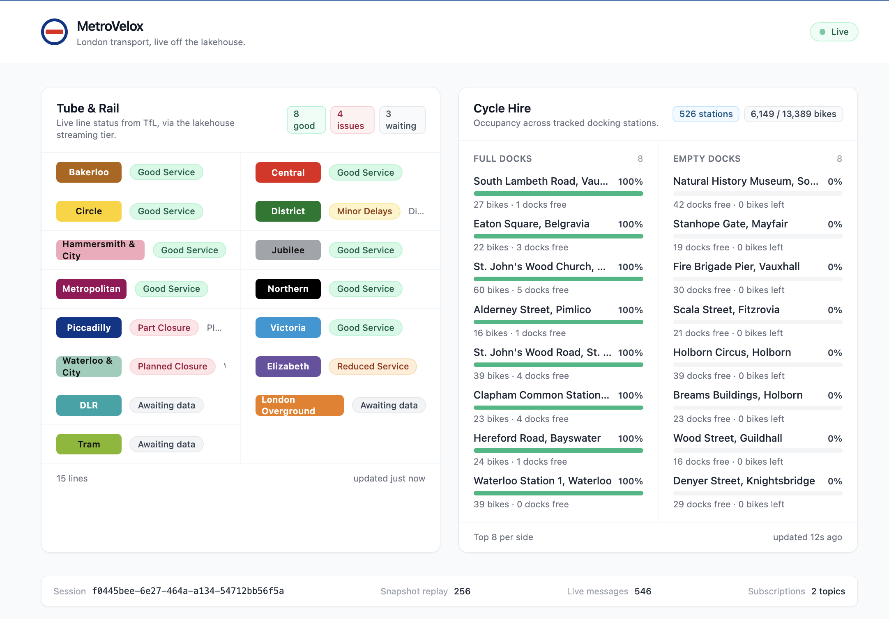

The live dashboard at [metrovelox.com](https://metrovelox.com) renders two
tiles off Kafka WebSocket fan-out:

- **Tube & rail line status** — current severity per line (Good Service,
  Minor Delays, Part Suspended, …) in official TfL colours, with
  summary counts. Source topic: `tfl.analytics.line-status-latest`.
- **Cycle hire dock occupancy** — live bike / dock counts for every
  station, with full-dock and empty-dock leaderboards plus a
  network-wide total. Source topic: `tfl.curated.bike-occupancy`.

Both tiles receive a rolling snapshot on subscribe (last N messages per
topic), so a new connection lights up immediately rather than waiting for
the next live update.

## Screenshots

Live shots from `metrovelox.com`.

### Streaming — Strimzi Kafka + Flink

Operators inspect brokers, topics and consumer groups in `kafka-ui`,
signed in via Keycloak OIDC.

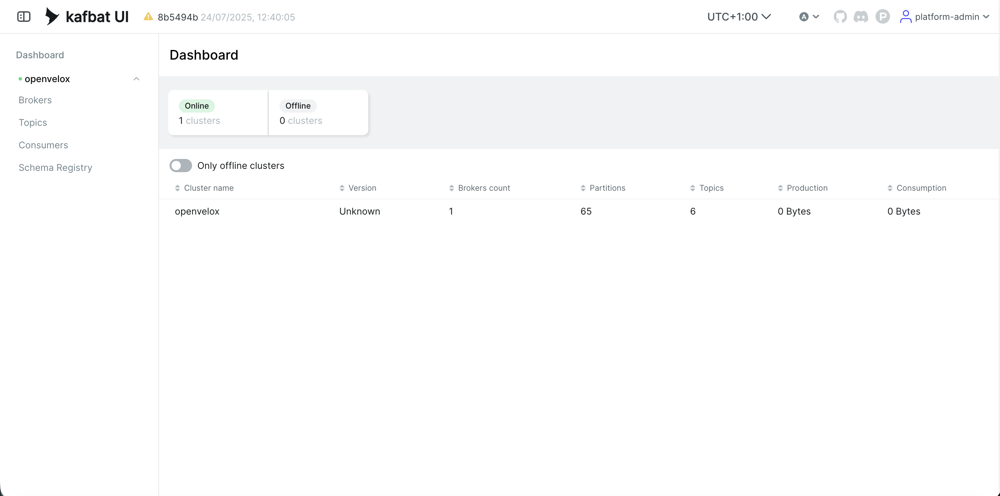
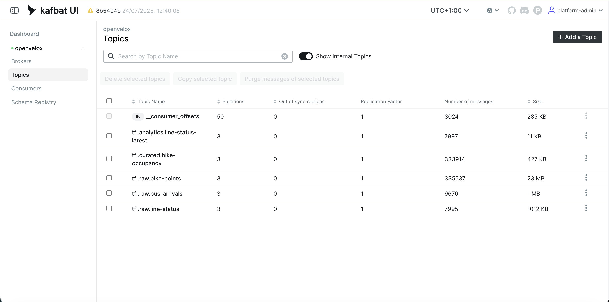
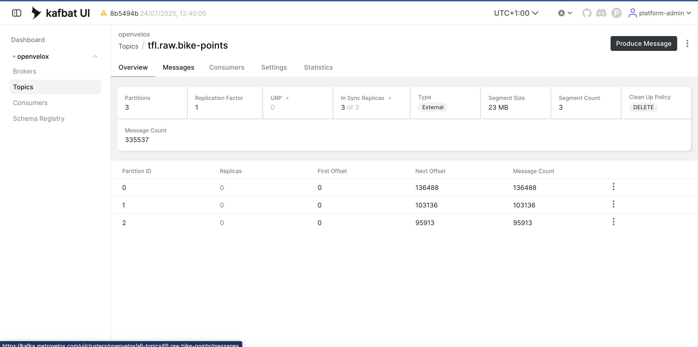
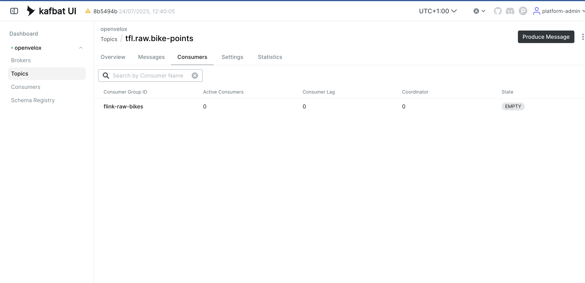
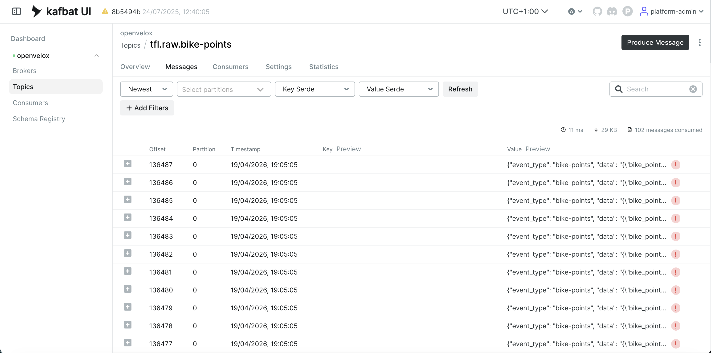
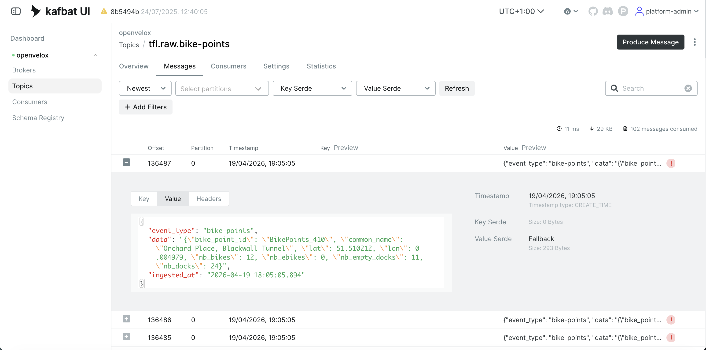

Flink SQL jobs run on a session cluster managed by the Flink Operator.

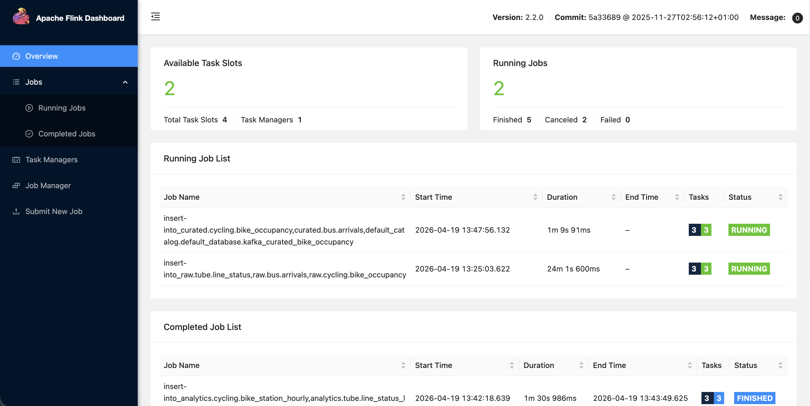
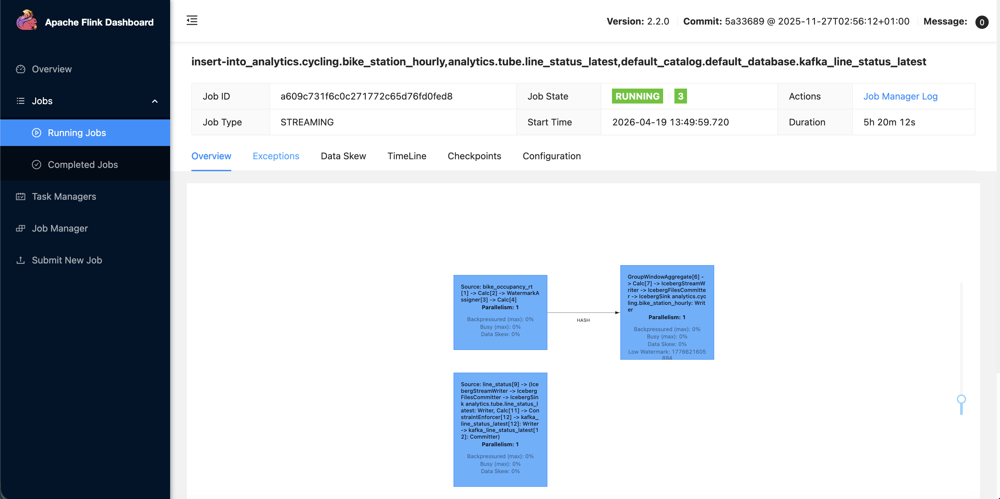

### Lakehouse — Apache Polaris

Polaris serves the Iceberg REST catalog; every authorizable operation is
forwarded to OPA, which evaluates the Rego policy in
`infra/k8s/data/opa/policies/`.

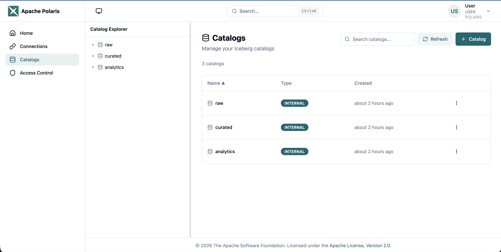
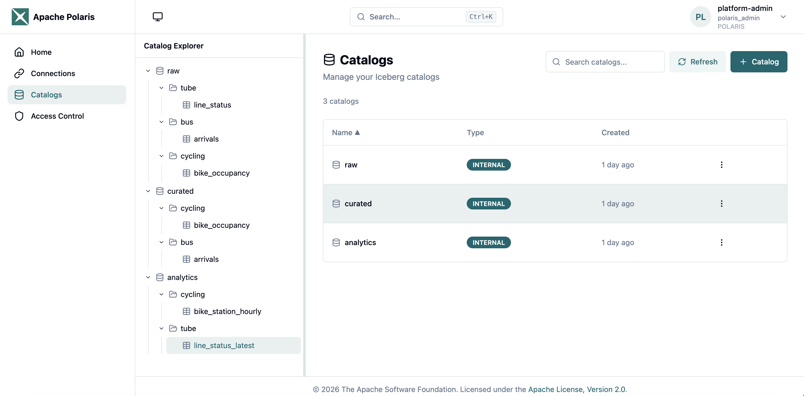
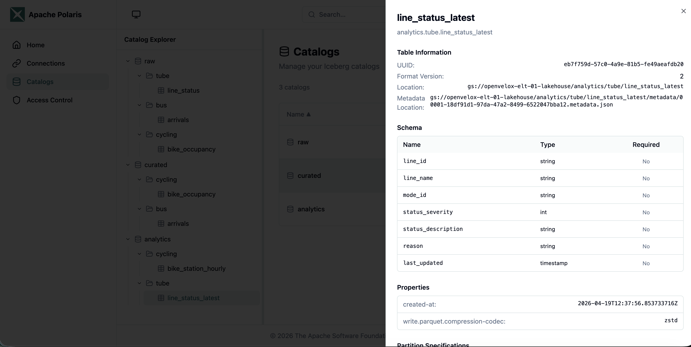
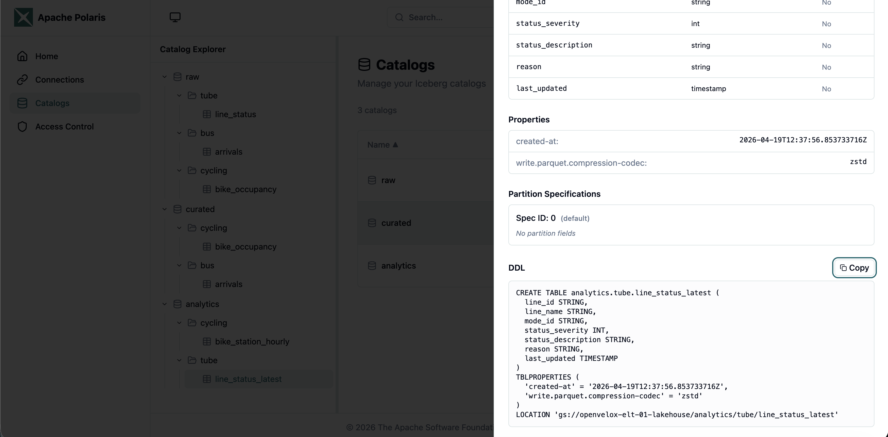

### Query — Trino

Trino authenticates users against Keycloak over OAuth2 in the web UI, the
`trino` CLI, and JDBC.

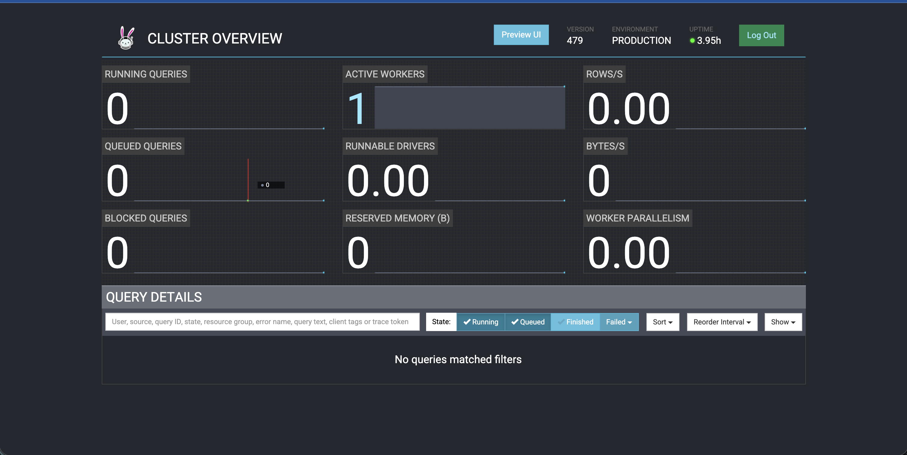

### Orchestration — Airflow

Airflow 3 pulls DAGs directly from Git via `GitDagBundle` (one bundle per
domain), with asset-driven scheduling chaining TfL ingestion → curated →
analytics.

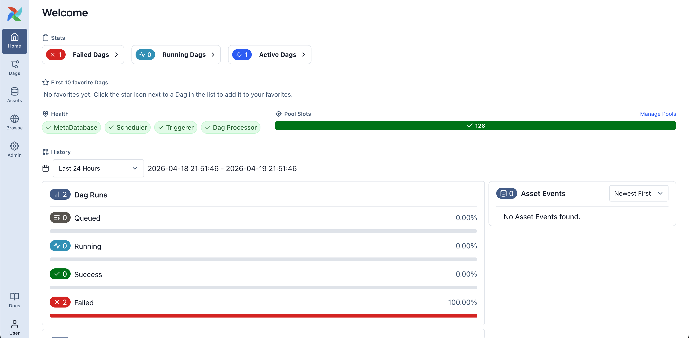

### Platform — ArgoCD + Keycloak

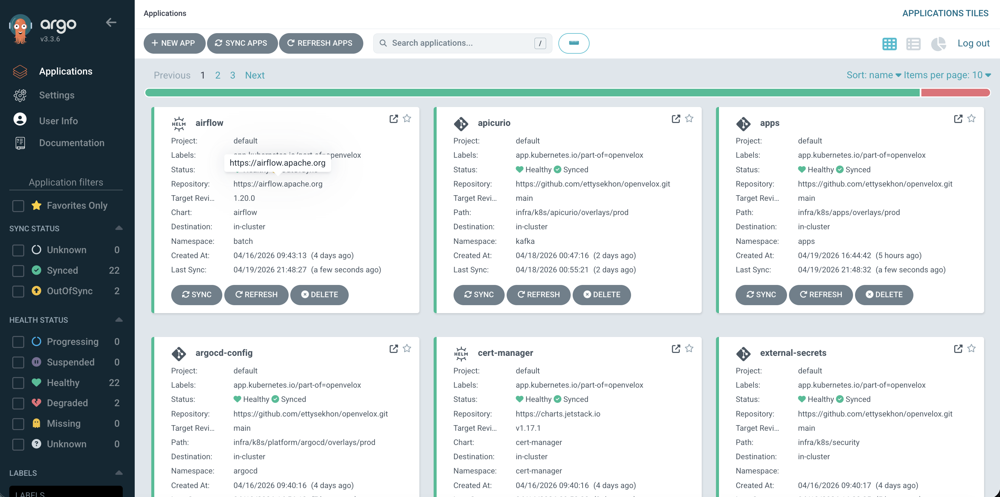
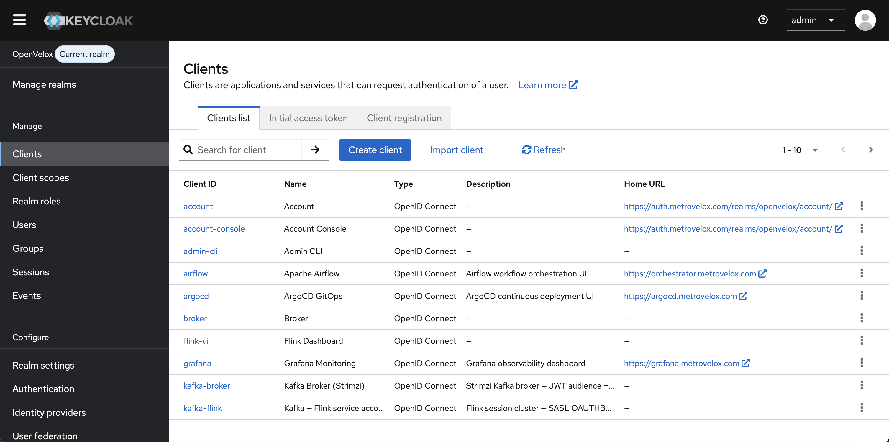

## Rubric-aligned technology map

Full self-assessment with remaining gaps:
[docs/CAPSTONE_SCORECARD.md](docs/CAPSTONE_SCORECARD.md).

| Capstone category     | Choice                                   | Evidence                                                                                                                                                  |
| --------------------- | ---------------------------------------- | --------------------------------------------------------------------------------------------------------------------------------------------------------- |
| Cloud + IaC           | GCP (GKE) + Terraform                    | [infra/terraform/](infra/terraform/)                                                                                                                      |
| Batch orchestration   | Apache Airflow 3 (asset-driven, `GitDagBundle`) | [pipelines/tfl/dags/](pipelines/tfl/dags/) — `ingest_tfl_sources` → `transform_curated` → `transform_analytics` + `quality_gates` + `reference_scd2` |
| Stream processing     | Strimzi Kafka + Flink SQL                | [pipelines/tfl/streaming/producer/](pipelines/tfl/streaming/producer/), [pipelines/tfl/streaming/flink-jobs/](pipelines/tfl/streaming/flink-jobs/)        |
| Data warehouse        | Apache Iceberg via Polaris REST, queried by Trino | [pipelines/tfl/sql/](pipelines/tfl/sql/), [pipelines/tfl/streaming/flink-jobs/](pipelines/tfl/streaming/flink-jobs/)                              |
| Transformations       | Spark + Flink SQL + Trino SQL            | [pipelines/tfl/spark/k8s/](pipelines/tfl/spark/k8s/), [pipelines/tfl/sql/](pipelines/tfl/sql/), [pipelines/tfl/streaming/flink-jobs/](pipelines/tfl/streaming/flink-jobs/) |
| Dashboard             | Next.js + WebSocket (FastAPI gateway)    | [apps/frontend/](apps/frontend/), [apps/api/](apps/api/)                                                                                                  |
| Reproducibility       | `scripts/bootstrap.sh` + ArgoCD GitOps   | [scripts/bootstrap.sh](scripts/bootstrap.sh), [docs/QUICKSTART.md](docs/QUICKSTART.md)                                                                    |
| Extras — Make         | `Makefile`                               | [Makefile](Makefile) — `make bootstrap`, `make opa-test`, `make opa-lint`                                                                                 |
| Extras — CI/CD        | GitHub Actions                           | [.github/workflows/ci.yaml](.github/workflows/ci.yaml) — `render-check` + `opa-test`                                                                      |
| Extras — Tests        | OPA Rego unit tests                      | [infra/k8s/data/opa/policies/polaris_test.rego](infra/k8s/data/opa/policies/polaris_test.rego)                                                            |
| Extras — Authorisation | Polaris external PDP                    | [infra/k8s/data/opa/policies/polaris.rego](infra/k8s/data/opa/policies/polaris.rego) — default-deny, per-role + warehouse-scoped                          |

## Quick start

```bash
# 1. Clone (Polaris console is a submodule)
git clone --recurse-submodules https://github.com/ettysekhon/metrovelox.git
cd metrovelox
cp env.sh.template env.sh
# Edit env.sh: DOMAIN, PROJECT_ID, REGION, ZONE, TFL_API_KEY, …

# 2. (Fork only) Re-template manifests for your domain / GitHub org.
vi config.env                    # DOMAIN, GITHUB_ORG, GITHUB_REPO
scripts/render-manifests.sh      # regenerates *.yaml from *.tmpl.yaml

# 3. Provision the GCP foundation + GKE cluster + storage
source env.sh
scripts/tf-apply.sh all $ENV

# 4. Bootstrap the platform (ArgoCD → Helm → ExternalSecrets → …)
scripts/bootstrap.sh --env $ENV

# 5. Initialise Vault and seed the Keycloak realm
scripts/vault-init.sh --env $ENV
```

Full walkthrough in [docs/QUICKSTART.md](docs/QUICKSTART.md).

### Configuring a fork

Non-secret values — base domain and GitHub repo URL — are templated via
`config.env`, which is substituted into every `*.tmpl.yaml`. Secrets stay
in `env.sh` (gitignored) and Vault.

| File                      | Committed? | Contains                                       |
| ------------------------- | ---------- | ---------------------------------------------- |
| `config.env`              | yes        | `DOMAIN`, `GITHUB_ORG`, `GITHUB_REPO`          |
| `config.env.example`      | yes        | Reference copy for forks                       |
| `env.sh`                  | no         | PATs, API keys, GCP project IDs, passwords     |
| `*.tmpl.yaml`             | yes        | Templates with `${DOMAIN}` / `${GITHUB_ORG}` … |
| `*.yaml` (alongside tmpl) | yes        | Rendered output consumed by ArgoCD + Kustomize |

Run `scripts/render-manifests.sh` after editing `config.env`. CI runs it
in `--check` mode and fails on drift.

## Multi-environment

```bash
scripts/new-env.sh staging yourdomain.com your-gcp-project-staging
```

Each environment gets its own GKE cluster, DNS prefix (`dev.`, `staging.`),
Terraform state, Kustomize overlays, Helm values, and ArgoCD Applications.

## Project structure

```text
.
├── apps/           Application code (FastAPI API, Next.js dashboard)
├── argocd/         ArgoCD Application manifests (apps/ + per-env overlays)
├── docker/         Container images (custom Airflow)
├── docs/           Documentation
├── helm/           Helm value overrides per service per environment
├── infra/          Terraform (GCP + Keycloak realm) and K8s manifests (Kustomize)
├── pipelines/      Domain pipelines — fork `pipelines/tfl/` to onboard a new domain
│   └── tfl/        Transport for London reference implementation
├── platform/       Shared platform assets (smoke tests, base images)
└── scripts/        Platform lifecycle scripts (bootstrap, deploy, scaffold)
```

Everything under `pipelines/` is domain-specific. Everything else is
reusable platform. See [pipelines/tfl/README.md](pipelines/tfl/README.md).

## Documentation

| Document                                                                 | Scope                                                     |
| ------------------------------------------------------------------------ | --------------------------------------------------------- |
| [QUICKSTART](docs/QUICKSTART.md)                                         | End-to-end provisioning from a clean clone                |
| [CAPSTONE_SCORECARD](docs/CAPSTONE_SCORECARD.md)                         | Rubric self-assessment with remaining gaps                |
| [ARCHITECTURE](docs/ARCHITECTURE.md)                                     | System design, data flows, component versions             |
| [GOVERNANCE_IDENTITY_AND_ACCESS](docs/GOVERNANCE_IDENTITY_AND_ACCESS.md) | SSO, Vault, Polaris + OPA, per-app authorisation          |
| [SCALING_AND_COST](docs/SCALING_AND_COST.md)                             | Node pools, autoscaling, cost, tuning                     |
| [ROADMAP](docs/ROADMAP.md)                                               | Outstanding platform gaps                                 |
| [TESTING_AND_RESILIENCE](docs/TESTING_AND_RESILIENCE.md)                 | Smoke, integration and chaos runbooks                     |
| [CATALOG](docs/CATALOG.md)                                               | Data catalog naming and semantic layers                   |
| [ENV-SETUP](docs/ENV-SETUP.md)                                           | Multi-environment configuration                           |

## License

Apache 2.0
